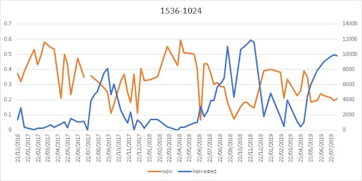
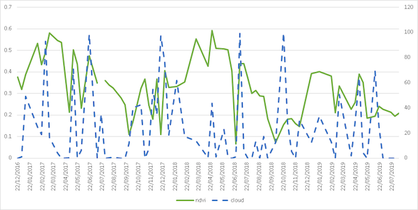
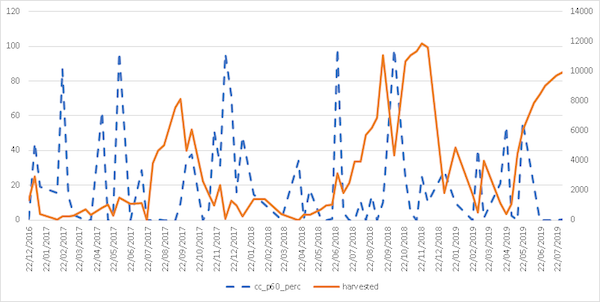

# Satellite Intelligence Datathon

Satellite Intelligence Datathon run by Melbourne Data Science and sponsored by Growing Data and ANZ.

http://www.datasciencemelbourne.com/datathon/

https://medium.com/satellite-intelligence

Project: Melbourne Datathon 2019, 14th Aug - 29 November. 

Delivery team: Jason Samaradiwakara, Rohit Kaul, Vijay, Eric Kimwatan, Brendan Houng

Date: 9 September 2019

## harvested pixels and ndvi index for prosperpine (tile 1536, 1024)

